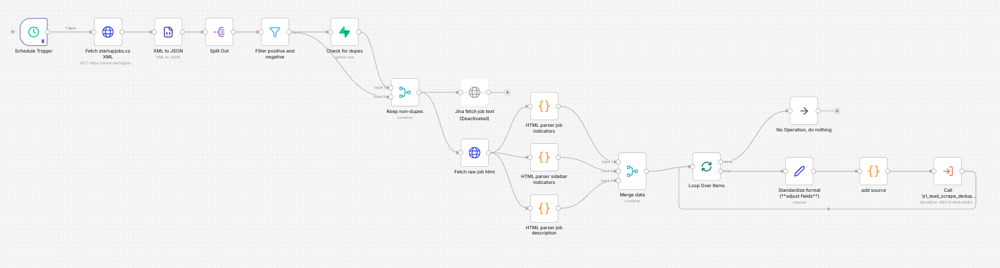

# 🚀 Phase 1: Lead Scraping & Deduplication
**Automated data extraction from LinkedIn & StartupJobs.cz with vector-based filtering.**

 

### 📊 Highlights
* **Noise Filtering:** Two-stage Regex targets only relevant listings and data for the database.
* **Direct XML/HTML Extraction:** 11-node custom parser extracts data directly from raw source code (0 cost and maintenance).
* **Semantic Deduplication:** 95% Cosine Similarity threshold (via pgvector) prevents duplicate leads across different sources.
* **Modular Structure:** Designed to accept new sources (e.g., Google Sheets) by mapping to a unified schema.

 

---

 

 

---

 

### 🎥 Video Walkthrough (100 Seconds)

 

---

 

### 🖼️ n8n Workflow Screenshots

**LinkedIn scraper:**

 

**Startupjobscz scraper:**

 

**Vector Deduplication Logic:**

 

---

 

### 📂 Technical Documentation
* [**Raw JSON Workflows**](workflows/)
* [**Detailed Technical README**](../README.md)

 

---

### ✅ Next steps
* **Source Expansion:** Expanding sources to include Wellfound, Jobs.cz, and Startup.jobs to get a more quality wide upper funnel.
* **Manual Source Bridge:** Connecting a Google Sheets flow for manual entry of leads from newsletters and other sources directly into the pipeline.
* **Active URL monitor:** Adding a validation sub-flow to perform daily status checks on live URLs, automatically flagging expired listings as `archived` in Supabase.
* **Format Standardization:** Refactoring all event-driven flows to use a standardized Set Node pattern for multi-source data normalization.
* **Standardize Naming Convention:** Rename all payload fields to use camel_case, snakeCase for code fields and double digit format 01, 02 for numbers in names.

 

---
[← Return to Portfolio](https://linktr.ee/dpha05)
