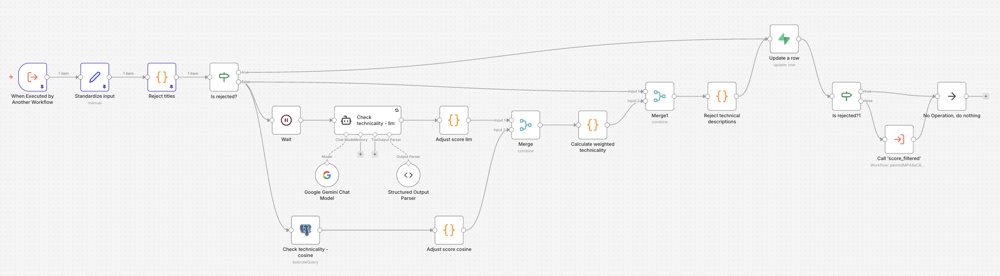
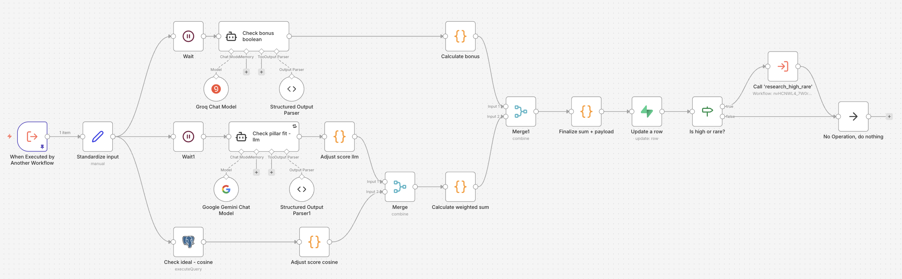
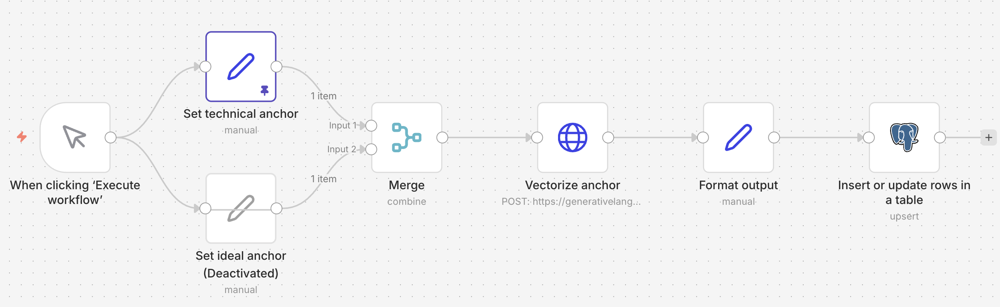
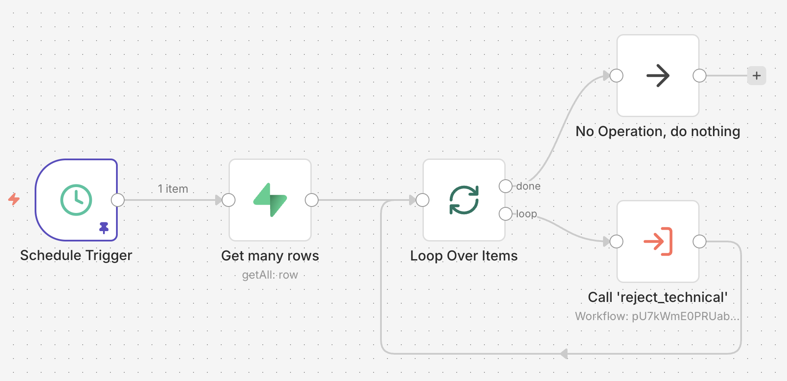

# 🧠 Phase 2: Lead Qualification 
**Hybrid weighted AI lead scoring with cosine semantic anchors.**

 

### 📊 Highlights
* **71% Rejection Filter:** Two-stage rejection of irrelevant leads: Regex keyword filter for titles and hybrid 70/30 weighted filtering with AI + Cosine Similarity for descriptions.
* **Hallucination Prevention:** For important pillars: frontier model **Gemini 3.0** with detailed system prompt, including scoring tiers, few-shot examples and standard value references and for benefits and logistics: lighter **OLlama 4 (Groq)** doing boolean extraction, leaving consistent math to code.
* **Self-Healing Status Sync:** Automated daily sync identifies leads in transient statuses (faulty executions) to ensure fault tolerance and minimize data loss.

 

---

 

 

---

 

### 🎥 Video Walkthrough (97 Seconds)

 

---

 

### 🖼️ n8n Workflow Screenshots

**Stage 1: Reject Technical Leads:**

 

**Stage 2: Score Filtered Leads:**

 

**Setting Global Anchors:**

 

**Sync Daily Status:**

 

---

 

### 📂 Technical Documentation
* [**Raw JSON Workflows**](workflows/)
* [**Detailed Technical README**](../README.md)

 

---

### ✅ Next steps
* **Auto-Apply Integration:** Researching automated "Quick Apply" triggers for roles hitting the 95th percentile "Rare" score.
* **Portfolio Matching:** Adding a sub-flow to compare specific job requirements against a vectorized database of my past projects to generate tailored highlights.
* **Multi-Persona Anchors:** Expanding the Global Anchor system to allow switching between different career personas (e.g., Technical Architect vs. Product Lead).
* **Local LLM Integration:** Testing Ollama integration for the Boolean branch to move the 33-question check entirely offline, further reducing API costs.
* **Enhanced Notifications:** Refining Pushover alerts to include a "Deep Link" directly to the job URL and a 1-sentence AI summary of why it was marked as 'Rare'.

 

---
[← Return to Portfolio](https://linktr.ee/dpha05)
